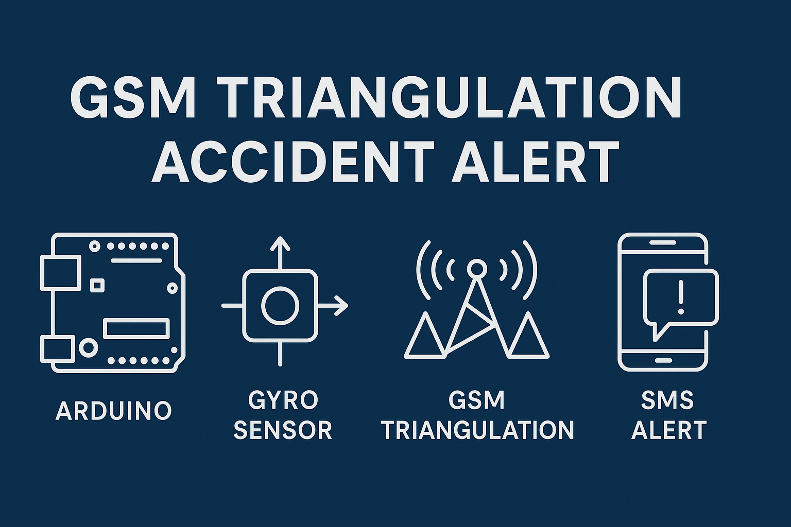
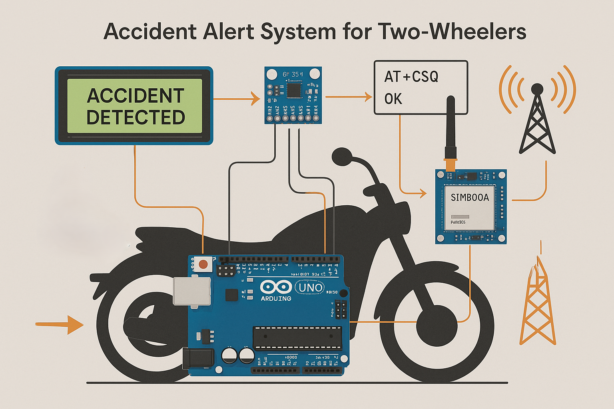

# GSM Triangulation Accident Alert



[](https://www.arduino.cc/)
[](LICENSE)
[](GSM)
[](Gryo)
[](https://github.com/HeleenaRobert)

A two-wheeler **accident detection and alert system** using:

- **Gyro-based crash detection (MPU-6050)**
- **GSM-based triangulation for location estimation (Cell Tower-based)**
- **SMS emergency alerts without GPS**

This system ensures quick and accurate emergency notifications by combining accident detection with GSM tower triangulation.

---

## 🚀 Features

- ✅ **Accident Detection** using MPU-6050 gyro sensor.
- ✅ **GSM Tower Triangulation** for approximate location estimation (no GPS required).
- ✅ **SMS Alerts** to predefined emergency contacts.
- ✅ **Local Indicators** (Buzzer + LED) and LCD display for status and GSM info.
- ✅ **Low-Cost & Battery Efficient** – GPS-free approach.

---

## 🔧 Components Used

- Arduino Uno (or compatible)
- GSM Module (SIM800L / SIM900)
- MPU-6050 Gyro Sensor
- Buzzer + LED (status indicator)
- 16x2 LCD Display (I2C)
- 9V Power Supply / Battery
- Breadboard & Jumper Wires

---

## 📊 System Workflow


---

## 🖥️ Block Diagram


---

## 🛠️ Circuit Diagrams

Sample diagrams provided in `/diagrams` folder:

- `gsm_module.png` – GSM sample image.
- `triangular_signal.png` – Image of how triangulation works.
- `full_setup.png` – Hardware assembly with sample connections.

---

## ⚙️ Wiring Guide

| Component         | Arduino Pin           | Notes                                    |
| ----------------- | --------------------- | ---------------------------------------- |
| **GSM TX**        | Pin 9 (Software RX)   | Connect GSM TX → Arduino RX (SoftSerial) |
| **GSM RX**        | Pin 10 (Software TX)  | Connect GSM RX → Arduino TX (SoftSerial) |
| **GSM Power**     | Pin 11                | Digital pin used to power ON GSM module  |
| **Gyro SDA**      | A4 (I2C)              | Shared I2C line                          |
| **Gyro SCL**      | A5 (I2C)              | Shared I2C line                          |
| **LCD SDA**       | A4 (I2C Shared)       | Shared with Gyro (I2C bus)               |
| **LCD SCL**       | A5 (I2C Shared)       | Shared with Gyro (I2C bus)               |
| **Buzzer**        | Pin 8                 | Active buzzer for alert sound            |
| **LED Indicator** | Pin 12                | LED for indicating the state             |

---

## 📄 File Structure

```Folder-Structure
GSM-Triangulation-Accident-Alert/
│
├── README.md
├── requirements.txt
├── .gitignore
├── LICENSE
│
├── diagrams/
│   ├── system_workflow.png
│   ├── block_diagram.png
│   ├── gsm_module.png
│   ├── trianguler_signal.png
│   └── full_setup.png
│
├── accident_alert/
│   └── accident_alert.ino
│
├── assets/
│   ├── banner.png
│   ├── prototype.png
│   └── detailed_workflow.png
│
└── docs/
    ├── explanation.md
    └── journal_reference.pdf
```

---

## 🔌 Usage Instructions

1. **Hardware Setup:**
   - Assemble GSM, gyro, buzzer, and LED as per wiring guide.
   - Insert SIM card in GSM module.

2. **Software Setup:**
   - Open Arduino IDE.
   - Install required libraries (MPU-6050).
   - Load `accident_alert.ino` and update emergency number.

3. **Configuration:**

   ```c
   const char* emergencyNumber = "+91XXXXXXXXXX"; // Set your contact
   ```

4. **Testing:**
   - Power the system.
   - Simulate tilt or impact.
   - Check if SMS includes tower triangulation details.

---

## 📷 Visual Example




---

## 📚 Documentation

Detailed explanation:  
➡ [docs/explanation.md](./docs/explanation.md)

---

## 🔮 Future Enhancements

- Convert Cell ID + LAC to actual GPS coordinates using APIs.
- Hybrid triangulation + GPS for better accuracy.
- IoT cloud integration for real-time monitoring.

---

## 📜 License

© 2025 Heleena Robert  
This project is licensed under the **Creative Commons Attribution-NonCommercial-NoDerivatives 4.0 International License**.  
[View License →](https://creativecommons.org/licenses/by-nc-nd/4.0/)

---

## 👩‍💻 Author

Developed by [Heleena Robert](https://github.com/HeleenaRobert)
