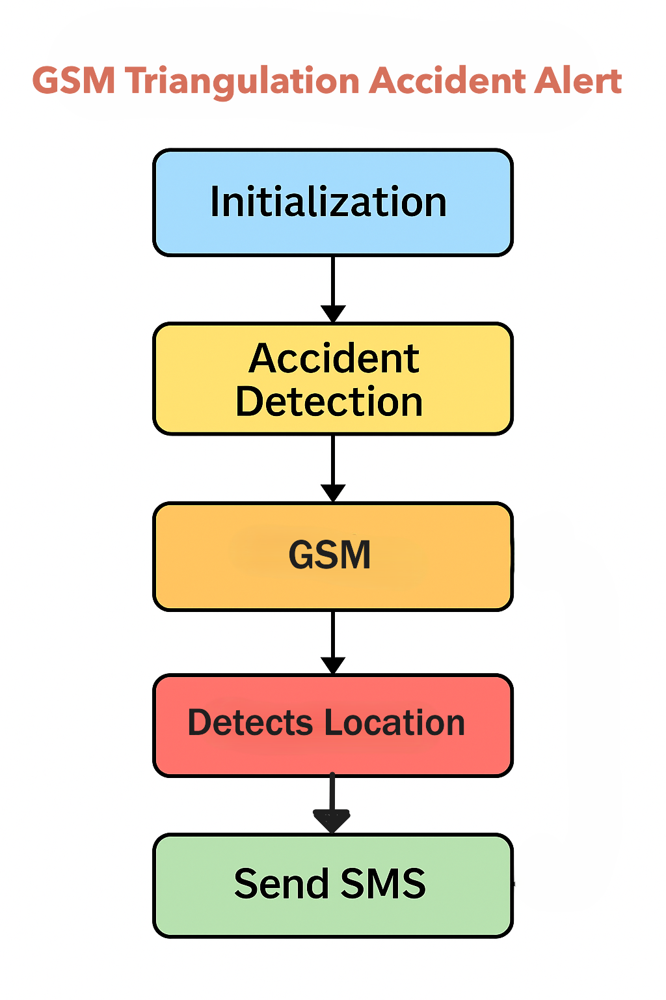
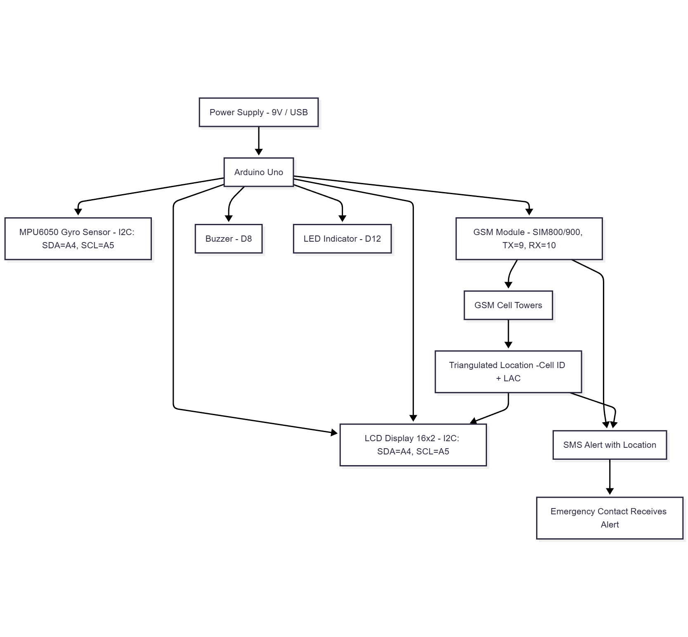

# GSM Triangulation Accident Alert – Detailed Explanation

## 1. Overview

The **GSM Triangulation Accident Alert** is a two-wheeler accident detection and alert mechanism. It integrates:

- **Gyro-based accident detection** (MPU-6050),
- **GSM-based triangulation for location estimation** (using nearby cell towers),
- **LCD (16x2 I2C)** displays real-time system status and GSM triangulation details (e.g., Cell ID, LAC) for debugging and user feedback.
- **SMS alerts** to emergency contacts (without GPS).

This ensures location-aware emergency notifications while remaining cost-effective and power-efficient.

---

## 2. System Workflow

1. **Initialization**
   - Arduino Uno initializes GSM module, gyro sensor and LCD display.
   - System enters standby mode.

2. **Accident Detection (Gyro)**
   - Gyro monitors tilt/impact continuously.
   - If abnormal tilt (> threshold) or sudden impact detected → system flags emergency.

3. **GSM Triangulation**
   - GSM module queries nearby towers.
   - Arduino fetches **Cell ID, LAC (Location Area Code), and RSSI (signal strength)**.
   - Location estimated via **triangulation using at least 3 towers** (no GPS required).

4. **Emergency SMS Alert**
   - Sends SMS containing:
     - Accident alert.
     - Approximate location (tower triangulation details).
     - LCD simultaneously shows "Emergency Alert Sent" with Cell ID & LAC info
     - Rider info (optional predefined text).

5. **Local Indicators**
   - Buzzer sounds + LED lights up for emergency confirmation.

---

## 3. GSM Triangulation Concept

GSM triangulation estimates location by:

- Measuring **signal strength (RSSI)** from multiple towers.
- Identifying **Cell IDs** and **LAC codes**.
- Cross-referencing with tower databases or APIs to derive approximate location (~100–500m accuracy in urban areas).

Unlike GPS:

- No satellite lock required.
- Works indoors or in low-signal areas.
- Faster and battery-efficient.

---

## 4. Components

- **Arduino Uno**: Core microcontroller.
- **GSM Module (SIM800L/900)**: Handles cellular communication and tower triangulation.
- **MPU-6050 Gyro Sensor**: Detects tilt, crash, or sudden motion.
- **16x2 LCD Display (I2C)**: For showing system state and GSM triangulation info.
- **Buzzer & LED**: Local emergency indicators.
- **9V Power Supply**: System power.

---

## 5. GSM Triangulation Flow

1. GSM connects to the nearest tower.
2. Retrieves:
   - Cell ID (CID)
   - Location Area Code (LAC)
   - RSSI (signal strength)
3. Uses data from multiple towers to approximate coordinates.
4. Includes this in SMS for emergency contacts.

---

## 6. Advantages

- **GPS-free location**: Uses existing cellular infrastructure.
- **Cost-effective**: No extra GPS module.
- **Fast alerts**: Immediate SMS with location info.
- **Automatic detection**: Gyro ensures crash detection without manual trigger.

---

## 7. Future Enhancements

- Integrate online APIs to convert **Cell ID/LAC** to human-readable locations (e.g., Google Cell Tower API).
- Combine GSM triangulation with optional GPS for higher accuracy.

---

## 8. Block Diagram

---

## 9. Conclusion

The **GSM Triangulation Accident Alert** is a GPS-free accident detection and emergency alert solution. By combining **gyro-based crash detection** with **GSM tower triangulation**, it ensures quick and accurate emergency notifications with minimal hardware.
